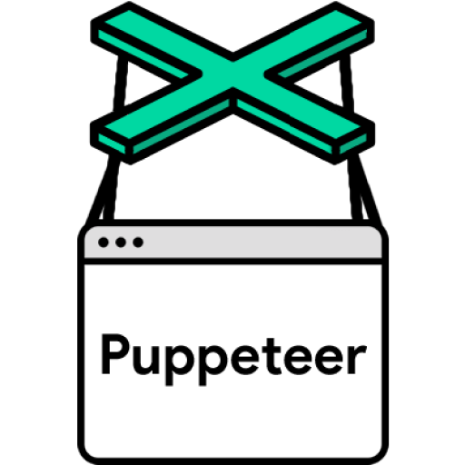

 

<h2>About me</h2>
 
Hi, I am Ashwin and i design and develop user interfaces. I am experienced in HTML5, CSS3, JavaScript and React. In 2011 I started building webpages using HTML and CSS as just a hobby but in early 2019 I started pursuing web development as my career. I am also pursuing 'B.Tech' in computer science and will graduate in 2023.
 
<h2>Technologies i know</h2>
 
<code></code>
<code></code>
<code></code>
<code></code>
<code></code>
<code></code>
 
<h2>Technologies i have also worked with</h2>
 
<code></code>
<code></code>
<code></code>
<code></code>
<code></code>
<code></code>
<code></code>
<code></code>
<code></code>
 
<h2>What's up with me these days ?</h2>

-   Building a production ready discord music bot with a never before introduced feature where users can create their own playlist and play it in any voice channel with a command.

-   Getting Into WEB 3.0